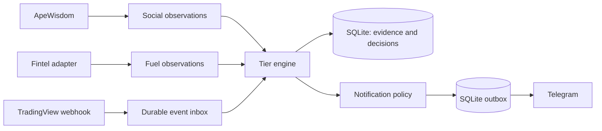

# SqueezeAlert V1 — architecture and implementation specification

Status: design pack, prepared 2026-09-29. Application code, tests, deployment, and live integrations have not been built or run.

Build one Python application with a deterministic tier engine, durable SQLite records, and Telegram delivery. OpenClaw assists with development and maintenance; the running alert service does not need an LLM.



| Tier | Meaning | Telegram policy |
| --- | --- | --- |
| 1 | Social attention | Always silent |
| 2 | Social attention plus squeeze fuel | Silent unless `SEND_TIER_2_ALERTS=true` |
| 3 | Tier 2 plus market confirmation | Enabled by default |
| 4 | Stronger Tier 3 continuation conditions | Urgent alert enabled by default |

An alert requests manual review. There is no trade execution, brokerage connection, buy/sell instruction, or validated probability of a squeeze. Numerical screening defaults are provisional engineering inputs.

## Start here

1. Read [ARCHITECTURE.md](ARCHITECTURE.md) for the proposed repository and execution flow.
2. Read [docs/TIER_RULES.md](docs/TIER_RULES.md) and [docs/CONTRACTS.md](docs/CONTRACTS.md) for exact behavior.
3. Read [AGENTS.md](AGENTS.md), [TASKS.md](TASKS.md), and [DECISIONS.md](DECISIONS.md) for repository instructions, build sequence, and decision provenance.
4. Use [prompts/02-BUILD.md](prompts/02-BUILD.md) when ready for the local MVP implementation, then [prompts/03-REVIEW.md](prompts/03-REVIEW.md) for correctness review.

## Repository contents

| File or folder | Purpose |
| --- | --- |
| [AGENTS.md](AGENTS.md) | Repository engineering instructions and product boundaries |
| [ARCHITECTURE.md](ARCHITECTURE.md) | Proposed application layout, persistence, and execution flow |
| [docs/TIER_RULES.md](docs/TIER_RULES.md), [docs/CONTRACTS.md](docs/CONTRACTS.md) | Tier rules and integration contracts |
| [ROADMAP.md](ROADMAP.md) | Deferred product ideas, including an exhaustion model |
| [TASKS.md](TASKS.md), [DECISIONS.md](DECISIONS.md) | Build sequence and decision provenance |
| [RUNBOOK.md](RUNBOOK.md) | Intended development and operating procedures |
| [docs/AGENT_ROLES.md](docs/AGENT_ROLES.md) | Optional engineering and review delegation briefs |
| [docs/ACCEPTANCE.md](docs/ACCEPTANCE.md) | Required behavioral checks |
| [docs/SOURCES.md](docs/SOURCES.md) | Official product references and unverified dependencies |
| [prompts/02-BUILD.md](prompts/02-BUILD.md), [prompts/03-REVIEW.md](prompts/03-REVIEW.md) | Local implementation and correctness-review prompts |
| [docs/CONFIGURATION.md](docs/CONFIGURATION.md) | Proposed sanitized settings; no environment files are published |

## Included design-pack tree

```text
repository/
├── README.md, ARCHITECTURE.md, TASKS.md, DECISIONS.md
├── AGENTS.md, ROADMAP.md, RUNBOOK.md
├── docs/       # rules, contracts, config, acceptance, sources, engineering roles
├── prompts/    # build and review
└── .gitignore
```

Agent workspace instructions, persona files, installed skills, private memory, and setup/maintenance procedures are kept outside this repository. Installation backups, local paths, credential records, databases, logs, and all `.env` files are excluded from publication.

The application tree in ARCHITECTURE.md is a build specification. Empty source modules and pretend test results are intentionally absent. See TASKS.md for implementation status.

## External dependencies still to confirm

Fintel account entitlements and exact response schemas; the TradingView indicator/alert setup and symbol coverage; a Telegram bot and destination; the eventual public HTTPS address. These do not block a fully offline fixture-based build.
