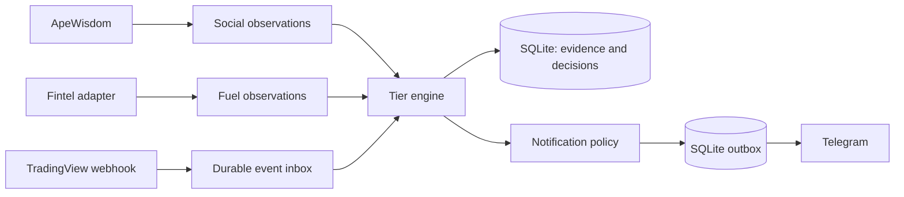

# SqueezeAlert V1 — architecture and OpenClaw handoff

Status: design pack, prepared 2026-09-29. Application code, tests, deployment, and live integrations have not been built or run.

Build one Python application with a deterministic tier engine, durable SQLite records, and Telegram delivery. OpenClaw assists with development and maintenance; the running alert service does not need an LLM.



| Tier | Meaning | Telegram policy |
| --- | --- | --- |
| 1 | Social attention | Always silent |
| 2 | Social attention plus squeeze fuel | Silent unless `SEND_TIER_2_ALERTS=true` |
| 3 | Tier 2 plus market confirmation | Enabled by default |
| 4 | Stronger Tier 3 continuation conditions | Urgent alert enabled by default |

An alert requests manual review. There is no trade execution, brokerage connection, buy/sell instruction, or validated probability of a squeeze. Numerical screening defaults are provisional engineering inputs.

## Start here

1. Read [ARCHITECTURE.md](ARCHITECTURE.md) for the proposed repository and execution flow.
2. Read [docs/TIER_RULES.md](docs/TIER_RULES.md) and [docs/CONTRACTS.md](docs/CONTRACTS.md) for exact behavior.
3. Follow [OPENCLAW_SETUP.md](OPENCLAW_SETUP.md) to adopt the pack into a separate existing OpenClaw workspace while keeping this repository as the application working directory.
4. Paste [prompts/01-INITIALIZE.md](prompts/01-INITIALIZE.md) into OpenClaw to inspect and adopt the pack.
5. Paste [prompts/02-BUILD.md](prompts/02-BUILD.md) when ready for the local MVP implementation.

## Pack contents

| File or folder | Purpose |
| --- | --- |
| [AGENTS.md](AGENTS.md) | Versioned project instruction template and product boundaries |
| [SOUL.md](SOUL.md), [IDENTITY.md](IDENTITY.md), [USER.md](USER.md) | Project persona/preference templates; preserve the existing agent identity at installation |
| [TOOLS.md](TOOLS.md) | Environment reference explicitly linked by AGENTS.md |
| [SKILLS.md](SKILLS.md), `skills/` | Skill index and five actual OpenClaw skills |
| [templates/workspace/](templates/workspace/README.md) | Sanitized memory/diary seeds; active memory and dated notes stay outside this repository |
| [DREAMING.md](DREAMING.md), [HEARTBEAT.md](HEARTBEAT.md) | Manual reflection guidance and comment-only inactive heartbeat template |
| [ROADMAP.md](ROADMAP.md) | Deferred ideas, including an exhaustion model |
| [TASKS.md](TASKS.md), [DECISIONS.md](DECISIONS.md) | Build sequence and decision provenance |
| [RUNBOOK.md](RUNBOOK.md) | Intended development and operating procedures |
| [docs/AGENT_ROLES.md](docs/AGENT_ROLES.md) | Lead, integration, verification, and memory role briefs |
| [docs/ACCEPTANCE.md](docs/ACCEPTANCE.md) | Required behavioral checks |
| [docs/SOURCES.md](docs/SOURCES.md) | Official references and unverified dependencies |
| [prompts/03-REVIEW.md](prompts/03-REVIEW.md), [prompts/04-REFLECT.md](prompts/04-REFLECT.md) | Review and evidence-based memory prompts |
| [docs/CONFIGURATION.md](docs/CONFIGURATION.md) | Proposed settings as sanitized documentation; no environment files are published |

## Included design-pack tree

```text
repository/
├── README.md, ARCHITECTURE.md, TASKS.md, DECISIONS.md
├── ROADMAP.md, RUNBOOK.md, OPENCLAW_SETUP.md
├── AGENTS.md, SOUL.md, IDENTITY.md, USER.md       # versioned templates
├── TOOLS.md, SKILLS.md, DREAMING.md, HEARTBEAT.md # versioned templates
├── docs/                                        # rules, contracts, config, acceptance, sources
├── prompts/                                     # adopt, build, review, reflect
├── skills/                                      # five installable skill source templates
├── templates/workspace/                         # sanitized memory/diary seeds only
└── .gitignore
```

The separate private agent workspace holds installed instructions, actual runtime memory, dated notes, and diary. These are never copied back into the repository. Installation backups, local paths, credential records, databases, logs, and all `.env` files are excluded from publication. SKILLS.md is an index, not a registration mechanism; DREAMING.md does not activate native dreaming; HEARTBEAT.md remains inactive.

The application tree in ARCHITECTURE.md is a build specification. Empty source modules and pretend test results are intentionally absent. See TASKS.md for implementation status.

## External dependencies still to confirm

Fintel account entitlements and exact response schemas; the TradingView indicator/alert setup and symbol coverage; a Telegram bot and destination; the eventual public HTTPS address. These do not block a fully offline fixture-based build.

OpenClaw conventions were checked against its current official [workspace](https://docs.openclaw.ai/concepts/agent-workspace), [skills](https://docs.openclaw.ai/tools/skills), and [dreaming](https://docs.openclaw.ai/concepts/dreaming) documentation. Installed releases can differ; setup includes a version check.
